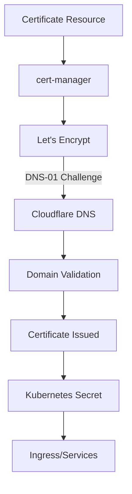

# Certificate Management with cert-manager

This document covers the setup and usage of [cert-manager](https://cert-manager.io/) for automated SSL/TLS certificate management in the homelab Kubernetes cluster.

## Overview

cert-manager automates the issuance and renewal of SSL/TLS certificates from Let's Encrypt using the DNS-01 challenge method with Cloudflare. Our setup includes:

- Wildcard certificates for `*.hm.hnnl.eu`
- Automatic certificate renewal
- DNS validation through Cloudflare

## Architecture

cert-manager works by watching for Certificate custom resources and then performing the necessary steps to obtain a certificate from Let's Encrypt:



## Components

### ClusterIssuer

We've configured two ClusterIssuers:

1. **letsencrypt-staging**: For testing certificate issuance without hitting rate limits
2. **letsencrypt-prod**: For production-ready certificates

```yaml
apiVersion: cert-manager.io/v1
kind: ClusterIssuer
metadata:
  name: letsencrypt-prod
spec:
  acme:
    server: https://acme-v02.api.letsencrypt.org/directory
    email: your-email@example.com
    privateKeySecretRef:
      name: letsencrypt-prod
    solvers:
      - dns01:
          cloudflare:
            email: your-cloudflare-email@example.com
            apiTokenSecretRef:
              name: cloudflare-api-token-secret
              key: api-token
        selector:
          dnsZones:
            - "hm.hnnl.eu"
```

### Wildcard Certificate

A wildcard certificate is configured for `*.hm.hnnl.eu`:

```yaml
apiVersion: cert-manager.io/v1
kind: Certificate
metadata:
  name: hm-hnnl-eu-tls
spec:
  secretName: hm-hnnl-eu-tls
  issuerRef:
    name: letsencrypt-prod
    kind: ClusterIssuer
  commonName: "hm.hnnl.eu"
  dnsNames:
    - "hm.hnnl.eu"
    - "*.hm.hnnl.eu"
  duration: 2160h # 90 days
  renewBefore: 360h # 15 days
```

## Implementation

cert-manager is deployed via Helm and configured with the necessary Cloudflare credentials for DNS validation.

### Prerequisites

1. Cloudflare API token with:
   - Zone:Zone:Read permissions
   - Zone:DNS:Edit permissions
   
2. Domain `hm.hnnl.eu` managed by Cloudflare

### Using Certificates in Services

To use the certificates in your Ingress resources:

```yaml
apiVersion: networking.k8s.io/v1
kind: Ingress
metadata:
  name: example-ingress
  annotations:
    cert-manager.io/cluster-issuer: "letsencrypt-prod"
spec:
  tls:
  - hosts:
    - service.hm.hnnl.eu
    secretName: service-tls
  rules:
  - host: service.hm.hnnl.eu
    # ...
```

## Troubleshooting

If certificates aren't being issued properly:

1. Check certificate status:
   ```bash
   kubectl get certificates -A
   kubectl describe certificate hm-hnnl-eu-tls -n cert-manager
   ```

2. Verify ACME orders and challenges:
   ```bash
   kubectl get challenges -A
   kubectl get orders -A
   ```

3. Examine cert-manager logs:
   ```bash
   kubectl logs -n cert-manager -l app=cert-manager
   ```

## References

- [cert-manager Documentation](https://cert-manager.io/docs/)
- [Let's Encrypt](https://letsencrypt.org/)
- [Cloudflare API Tokens](https://developers.cloudflare.com/api/tokens/)
