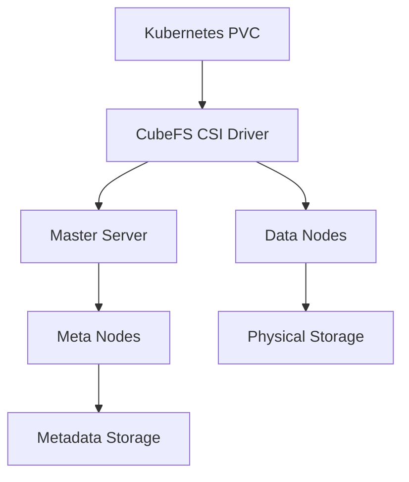

# CubeFS Storage

[CubeFS](https://www.cubefs.io) is the distributed storage solution used in the homelab Kubernetes cluster to provide persistent, replicated storage across all nodes.

## Overview

CubeFS provides:

- Distributed file system for Kubernetes
- Data redundancy across multiple nodes
- High availability for persistent volumes
- Kubernetes StorageClass integration
- Elastic scaling capabilities

## Architecture

The CubeFS deployment consists of:

1. **Master Server**: Manages metadata operations
2. **Meta Nodes**: Store file metadata
3. **Data Nodes**: Store actual file data
4. **CSI Driver**: Integrates with Kubernetes



## Configuration

### Deployment Configuration

CubeFS is deployed via Helm chart with the following configuration:

```yaml
master:
  replicas: 1
  resources:
    requests:
      cpu: 200m
      memory: 256Mi
    limits:
      cpu: 500m
      memory: 512Mi
  persistentVolume:
    enabled: true
    size: 5Gi

metanode:
  replicas: 3
  resources:
    requests:
      cpu: 200m
      memory: 512Mi
    limits:
      cpu: 1000m
      memory: 1Gi
  persistentVolume:
    enabled: true
    size: 20Gi

datanode:
  replicas: 3
  resources:
    requests:
      cpu: 200m
      memory: 512Mi
    limits:
      cpu: 1000m
      memory: 1Gi
  persistentVolume:
    enabled: true
    size: 50Gi
```

### Storage Class

The CubeFS StorageClass configuration:

```yaml
apiVersion: storage.k8s.io/v1
kind: StorageClass
metadata:
  name: cubefs-storage
  annotations:
    storageclass.kubernetes.io/is-default-class: "true"
provisioner: cubefs.csi.cubefs.com
parameters:
  volType: "extent"
  iopsRead: "20"
  iopsWrite: "20"
  reclaimPolicy: "Delete"
```

## Usage

### Creating a Persistent Volume Claim

Example PVC:

```yaml
apiVersion: v1
kind: PersistentVolumeClaim
metadata:
  name: my-data
  namespace: default
spec:
  accessModes:
    - ReadWriteOnce
  resources:
    requests:
      storage: 10Gi
  storageClassName: cubefs-storage
```

### Using the PVC in a Deployment

Example deployment using a PVC:

```yaml
apiVersion: apps/v1
kind: Deployment
metadata:
  name: my-app
spec:
  replicas: 1
  selector:
    matchLabels:
      app: my-app
  template:
    metadata:
      labels:
        app: my-app
    spec:
      containers:
      - name: app
        image: nginx
        volumeMounts:
        - name: data
          mountPath: /data
      volumes:
      - name: data
        persistentVolumeClaim:
          claimName: my-data
```

## Performance Considerations

For optimal performance with CubeFS:

- Set appropriate resource requests and limits
- Consider the workload IO pattern when configuring volumes
- Configure the number of replicas based on reliability needs
- Tune the volume parameters for specific workloads

## Monitoring

Monitor CubeFS with:

```bash
# View CubeFS pods
kubectl get pods -n cubefs

# Check volume status
kubectl get pv,pvc -A

# View logs
kubectl logs -n cubefs -l app=cubefs-master
```

## Troubleshooting

### Common Issues

1. **Volume Mounting Failures**:
   - Check CubeFS CSI driver logs
   - Verify the storage class exists
   - Check for available capacity

2. **Performance Issues**:
   - Monitor IO metrics
   - Check resource utilization
   - Verify network connectivity between nodes

3. **Data Node Failures**:
   - CubeFS will automatically recover if enough replicas exist
   - Check node status
   - Verify hardware health

### Log Checking

```bash
# Master logs
kubectl logs -n cubefs -l app=cubefs-master

# Meta node logs
kubectl logs -n cubefs -l app=cubefs-metanode

# Data node logs
kubectl logs -n cubefs -l app=cubefs-datanode

# CSI driver logs
kubectl logs -n cubefs -l app=cubefs-csi-driver
```
