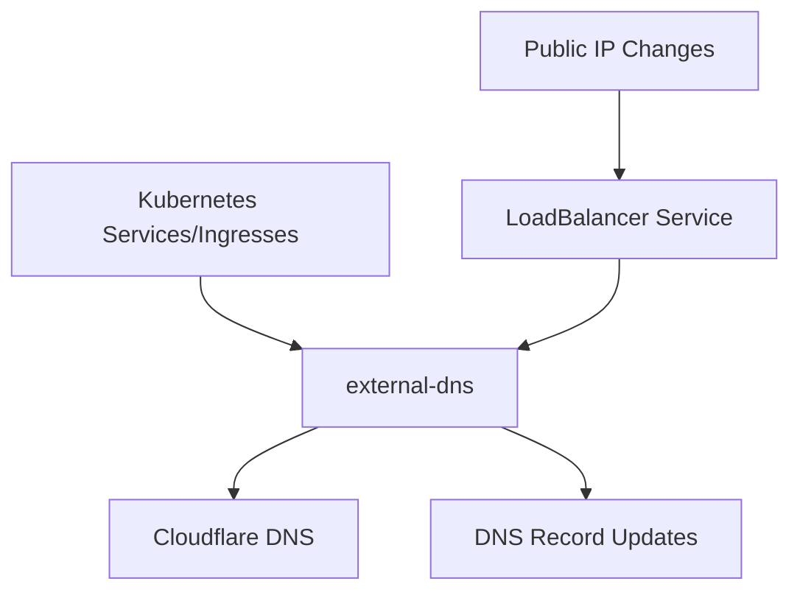

# DNS Management with external-dns

This document covers the setup and usage of [external-dns](https://github.com/kubernetes-sigs/external-dns) for automated DNS record management in the homelab Kubernetes cluster.

## Overview

external-dns automatically creates and updates DNS records in Cloudflare based on Kubernetes resources (Services and Ingresses). The system ensures that:

- The domain `hm.hnnl.eu` always points to the cluster's current public IP addresses (both IPv4 and IPv6)
- Service-specific subdomains are automatically created and updated

## Architecture

external-dns watches Kubernetes resources and updates DNS records in Cloudflare accordingly:



## Components

### external-dns Configuration

The external-dns deployment is configured to:

1. Watch for Services and Ingresses with specific annotations
2. Update DNS records in Cloudflare
3. Support both IPv4 and IPv6 addresses

```yaml
values:
  provider: cloudflare
  env:
    - name: CF_API_TOKEN
      valueFrom:
        secretKeyRef:
          name: cloudflare-api-token
          key: api-token
  extraArgs:
    - --cloudflare-proxied=false
    - --registry=txt
    - --txt-owner-id=homelab
    - --source=service
    - --source=ingress
  policy: sync
  domainFilters:
    - "hm.hnnl.eu"
```

### Public IP Service

A LoadBalancer Service is used to track and expose the cluster's public IP addresses:

```yaml
apiVersion: v1
kind: Service
metadata:
  name: cluster-public-ip
  annotations:
    external-dns.alpha.kubernetes.io/hostname: hm.hnnl.eu
spec:
  type: LoadBalancer
  ports:
    - port: 443
      name: https
    - port: 80
      name: http
```

## Implementation

external-dns is deployed via Helm and configured with Cloudflare credentials.

### Prerequisites

1. Cloudflare API token with:
   - Zone:Zone:Read permissions
   - Zone:DNS:Edit permissions
   
2. Domain `hm.hnnl.eu` managed by Cloudflare

### Creating DNS Records for Services

To automatically create DNS records for your services, add the following annotation to your Service or Ingress resources:

```yaml
metadata:
  annotations:
    external-dns.alpha.kubernetes.io/hostname: myapp.hm.hnnl.eu
```

For Services of type LoadBalancer, external-dns will automatically create A and AAAA records pointing to the assigned IP addresses.

## IPv4 and IPv6 Support

Our configuration supports dual-stack networking:

- A records for IPv4 addresses
- AAAA records for IPv6 addresses

This ensures your services are accessible over both IPv4 and IPv6 networks.

## Troubleshooting

If DNS records aren't updating correctly:

1. Check external-dns logs:
   ```bash
   kubectl logs -n external-dns -l app.kubernetes.io/name=external-dns
   ```

2. Verify the LoadBalancer service has external IPs assigned:
   ```bash
   kubectl get svc -n external-dns cluster-public-ip
   ```

3. Check DNS records in Cloudflare:
   ```bash
   dig +short hm.hnnl.eu
   dig +short AAAA hm.hnnl.eu
   ```

## References

- [external-dns Documentation](https://github.com/kubernetes-sigs/external-dns/blob/master/docs/tutorials/cloudflare.md)
- [Kubernetes Service annotations](https://kubernetes.io/docs/concepts/services-networking/service/)
- [Cloudflare DNS API](https://api.cloudflare.com/)
