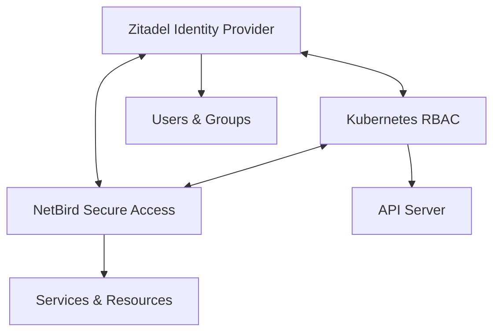
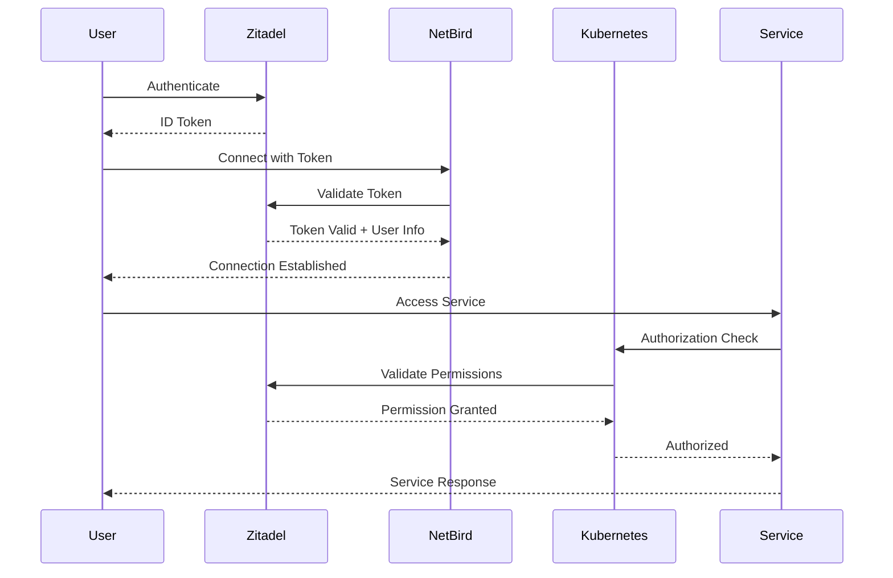

# Authentication and Security Integration

This guide explains how the identity management and secure access components work together in the homelab Kubernetes cluster.

## Architecture Overview

The authentication and security architecture consists of:

1. **Zitadel** - Core identity provider
2. **NetBird** - Secure network gateway
3. **Kubernetes** - RBAC integration with Zitadel



## Authentication Flow

1. **User Registration**:
   - User registers through Zitadel
   - Administrator assigns appropriate roles and groups

2. **Kubernetes Authentication**:
   - Kubernetes API server validates tokens against Zitadel
   - RBAC rules apply based on Zitadel groups/roles

3. **NetBird Authentication**:
   - NetBird management validates users via Zitadel OIDC
   - Access policies are enforced based on user identity

4. **Service Access**:
   - User connects to the NetBird network
   - NetBird enforces access based on policies
   - Services authenticate the user based on Zitadel identity



## Setting Up End-to-End Authentication

### 1. Initial Zitadel Configuration

1. Access Zitadel at https://id.homelab.local
2. Create organization structure
3. Define roles and groups 
4. Create users
5. Create OIDC clients:
   - For Kubernetes: `kubernetes`
   - For NetBird: `netbird-client-id`

### 2. Configuring Kubernetes Authentication

1. Update the Kubernetes API server configuration:
   ```yaml
   apiVersion: v1
   kind: Pod
   metadata:
     name: kube-apiserver
   spec:
     containers:
     - command:
       - kube-apiserver
       - --oidc-issuer-url=https://id.homelab.local
       - --oidc-client-id=kubernetes
       - --oidc-username-claim=email
       - --oidc-groups-claim=groups
   ```

2. Create RBAC rules mapping Zitadel groups to Kubernetes roles:
   ```yaml
   apiVersion: rbac.authorization.k8s.io/v1
   kind: ClusterRoleBinding
   metadata:
     name: zitadel-admins
   subjects:
   - kind: Group
     name: admins@homelab.local
     apiGroup: rbac.authorization.k8s.io
   roleRef:
     kind: ClusterRole
     name: cluster-admin
     apiGroup: rbac.authorization.k8s.io
   ```

### 3. Configuring NetBird Integration

1. Ensure NetBird management is configured to use Zitadel:
   ```yaml
   env:
     AUTH_OIDC_ENABLED: "true"
     AUTH_OIDC_ISSUER: "https://id.homelab.local"
     AUTH_OIDC_CLIENT_ID: "${SECRET_OIDC_CLIENT_ID}"
     AUTH_OIDC_CLIENT_SECRET: "${SECRET_OIDC_CLIENT_SECRET}"
   ```

2. Create NetBird network policies based on Zitadel groups
3. Map user roles to network access permissions

## User Workflow Example

**Admin user workflow**:

1. Admin logs into Zitadel
2. Admin can access:
   - Kubernetes cluster with admin privileges
   - NetBird dashboard with full access
   - All services exposed via NetBird

**Regular user workflow**:

1. User logs into Zitadel
2. User can access:
   - Limited Kubernetes resources based on RBAC
   - Only permitted services via NetBird
   - Cannot manage NetBird policies

## Security Recommendations

1. **Multi-factor Authentication**:
   - Enable MFA for all accounts in Zitadel
   - Require FIDO2/passkeys where possible

2. **Regular Auditing**:
   - Review access logs in Zitadel
   - Audit NetBird policies
   - Check Kubernetes RBAC assignments

3. **Network Security**:
   - Implement microsegmentation using NetBird policies
   - Review and update access rules regularly
   - Maintain strict ingress/egress rules

4. **Credential Management**:
   - Rotate service account credentials regularly
   - Enforce strong password policies
   - Use short-lived access tokens

## Troubleshooting Common Issues

### Authentication Failures

- Check Zitadel client configurations
- Verify OIDC endpoints are accessible
- Confirm user has appropriate roles/groups

### Access Denied Issues

- Review RBAC configurations in Kubernetes
- Check NetBird policies
- Verify user belongs to required groups in Zitadel

### Connection Problems

- Check NetBird client configuration
- Verify TURN service is operational
- Ensure firewall rules allow necessary traffic
