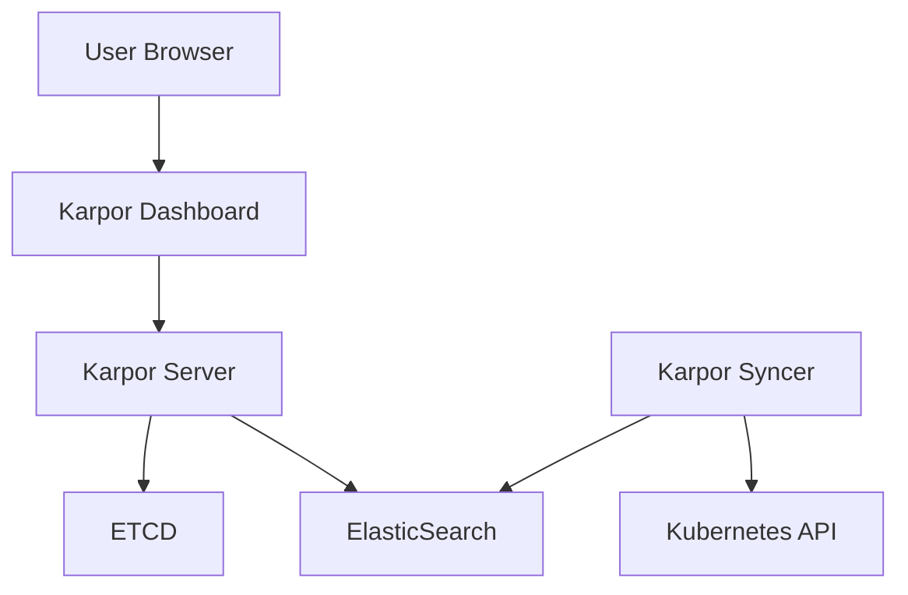

# Karpor

[Karpor](https://github.com/KusionStack/karpor) is an intelligence and visualization tool for Kubernetes that brings advanced Search, Insight, and AI capabilities to your cluster. It helps you gain visibility into your Kubernetes resources across multiple clusters.

## Overview

Karpor provides the following core features:

- **Advanced Search**: Powerful and flexible queries to locate resources across multiple clusters
- **Insights**: Visualize resource topology and compliance status
- **AI Integration**: AI-powered operations and analysis (with optional configuration)

## Architecture

Karpor consists of the following main components:

- **Karpor Server**: Backend API server that provides REST APIs to serve the dashboard
- **Karpor Syncer**: Synchronizes cluster resources in real-time
- **ElasticSearch**: Stores synchronized resources and user data
- **ETCD**: Storage for the Karpor Server



## Installation

Karpor is deployed using Helm:

```bash
# Add the Karpor Helm repository
helm repo add kusionstack https://kusionstack.github.io/charts
helm repo update

# Install Karpor
helm install karpor kusionstack/karpor \
  --namespace karpor \
  --create-namespace
```

### Configuration

The default configuration uses minimal resources suitable for a homelab environment. For production or customized deployments, consider setting specific values:

```bash
# Example with customized configuration
helm install karpor kusionstack/karpor \
  --set server.replicas=1 \
  --set syncer.replicas=1 \
  --set elasticsearch.resources.requests.memory=2Gi \
  --set elasticsearch.resources.limits.memory=2Gi
```

### AI Features (Optional)

To enable the AI capabilities, you need to provide an AI service token:

```bash
helm install karpor kusionstack/karpor \
  --set server.ai.authToken=YOUR_AI_TOKEN \
  --set server.ai.baseUrl=https://api.openai.com/v1 \
  --set server.ai.model=gpt-3.5-turbo
```

## Integration with Homelab Cluster

Karpor enhances the homelab cluster with:

1. **Multi-cluster Visibility**: View all your Kubernetes resources across your homelab environment
2. **Resource Topology**: Understand relationships between different components
3. **Compliance Monitoring**: Ensure your cluster follows best practices
4. **Intelligent Search**: Find resources quickly with natural language queries (when AI is enabled)

### Access

Once deployed, Karpor is accessible via:

```
http://<cluster-IP>:7443/
```

For secure access, configure Ingress or use port forwarding:

```bash
kubectl port-forward -n karpor svc/karpor-server 7443:7443
```

Then access Karpor at `http://localhost:7443`.

## Usage

### Dashboard Navigation

The Karpor dashboard provides several key views:

1. **Search**: Query for resources across all clusters
2. **Topology**: Visualize resource relationships
3. **Compliance**: Check for security and configuration best practices
4. **Settings**: Configure Karpor and cluster connections

### Adding Clusters

To add clusters to Karpor for monitoring:

1. Navigate to Settings > Clusters
2. Click "Add Cluster"
3. Provide the cluster's kubeconfig or connection details
4. Save the configuration

## Troubleshooting

### Common Issues

1. **Resources Not Showing**: Check the Karpor Syncer logs:
   ```bash
   kubectl logs -n karpor -l app=karpor-syncer
   ```

2. **Search Not Working**: Verify ElasticSearch is running:
   ```bash
   kubectl get pods -n karpor -l app=elasticsearch
   ```

3. **Dashboard Not Loading**: Check the Karpor Server status:
   ```bash
   kubectl get pods -n karpor -l app=karpor-server
   ```

## References

- [Karpor GitHub Repository](https://github.com/KusionStack/karpor)
- [Karpor Documentation](https://kusionstack.io/karpor/)
- [Helm Chart Repository](https://github.com/KusionStack/charts/tree/master/charts/karpor)
