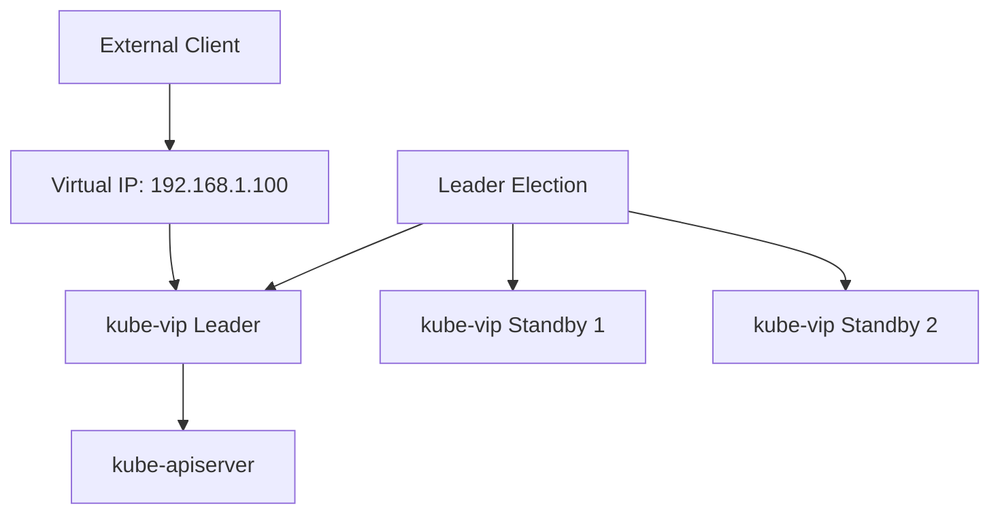

# kube-vip

[kube-vip](https://kube-vip.io/) provides virtual IP and load balancing capabilities for the Kubernetes cluster. This document outlines the configuration and usage in the homelab environment.

## Overview

kube-vip provides:

- Virtual IP for the Kubernetes control plane API server
- Load balancing for Kubernetes services
- Layer 2 (ARP) based IP address failover
- High availability for external services

## How It Works

kube-vip operates by:

1. Running as a DaemonSet on control plane nodes
2. Using leader election to ensure only one instance manages the virtual IP
3. Advertising the virtual IP via ARP
4. Monitoring control plane health
5. Failing over the virtual IP if the current leader becomes unavailable



## Configuration

### Deployment Configuration

kube-vip is deployed as a DaemonSet with the following configuration:

```yaml
apiVersion: apps/v1
kind: DaemonSet
metadata:
  name: kube-vip
  namespace: kube-system
spec:
  selector:
    matchLabels:
      name: kube-vip
  template:
    metadata:
      labels:
        name: kube-vip
    spec:
      containers:
        - args:
            - manager
          env:
            - name: vip_interface
              value: "eth0"
            - name: vip_address
              value: "192.168.1.100"
            - name: vip_leaderelection
              value: "true"
            - name: enable_loadbalancer
              value: "true"
          image: ghcr.io/kube-vip/kube-vip:v0.6.2
          securityContext:
            capabilities:
              add:
                - NET_ADMIN
                - NET_RAW
      hostNetwork: true
      nodeSelector:
        node.kubernetes.io/controller: "true"
```

### Virtual IPs

The cluster uses the following virtual IPs:

| Service | IP Address | Description |
|---------|------------|-------------|
| Kubernetes API | 192.168.1.100 | Control plane access |
| Zitadel | 192.168.1.110 | Identity provider |

## Using kube-vip for Services

To expose a Kubernetes service with a virtual IP:

```yaml
apiVersion: v1
kind: Service
metadata:
  name: my-service
  namespace: default
  annotations:
    kube-vip.io/loadbalancerIPs: "192.168.1.120"
spec:
  type: LoadBalancer
  ports:
    - port: 80
      targetPort: 8080
  selector:
    app: my-app
```

## Monitoring

Monitor kube-vip with:

```bash
# Check pod status
kubectl get pods -n kube-system -l name=kube-vip

# View logs
kubectl logs -n kube-system -l name=kube-vip

# Verify virtual IP
ping -c 1 192.168.1.100
```

## Troubleshooting

### Common Issues

1. **Virtual IP Not Responding**:
   - Check if kube-vip pods are running
   - Verify ARP configuration
   - Check network connectivity
   - Ensure the interface is correctly specified

2. **Leader Election Issues**:
   - Check kube-vip logs for election problems
   - Verify Kubernetes API is accessible
   - Ensure multiple kube-vip instances are not running in conflict

3. **Service Load Balancer Issues**:
   - Verify service has correct annotations
   - Check kube-vip logs for service-related messages
   - Ensure the specified IP is available

### Log Checking

```bash
# View kube-vip logs
kubectl logs -n kube-system -l name=kube-vip

# Check for ARP issues
kubectl exec -n kube-system $(kubectl get pods -n kube-system -l name=kube-vip -o name | head -1) -- arp -an

# Verify virtual IP is advertised
kubectl exec -n kube-system $(kubectl get pods -n kube-system -l name=kube-vip -o name | head -1) -- ip addr
```

## Security Considerations

Keep in mind:

- kube-vip requires high privileges (NET_ADMIN capability)
- Secure access to the virtual IPs with proper network security
- Monitor for unauthorized ARP spoofing on the network
- Consider network segregation for sensitive services

## References

- [kube-vip GitHub Repository](https://github.com/kube-vip/kube-vip)
- [kube-vip Documentation](https://kube-vip.io/docs/)
