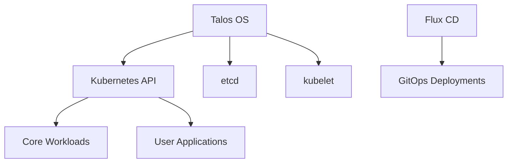

# Kubernetes Configuration

This document describes the Kubernetes implementation in the homelab cluster, including configuration details and management practices.

## Architecture

The homelab Kubernetes cluster uses:

- **High Availability**: 3-node control plane with distributed etcd
- **Dual-Purpose Nodes**: All nodes serve as both control plane and worker nodes
- **Talos OS**: Minimal and secure operating system specifically for Kubernetes
- **GitOps**: Configuration managed via Flux CD



## Components

### Control Plane

The control plane includes:

- **kube-apiserver**: The API server for the Kubernetes cluster
- **kube-controller-manager**: Manages controller processes
- **kube-scheduler**: Assigns workloads to nodes
- **etcd**: Distributed key-value store for cluster data

### Worker Components

Worker components include:

- **kubelet**: The primary node agent
- **kube-proxy**: Network proxy for implementing Kubernetes services
- **Container Runtime**: containerd for running containers

### Networking

Networking leverages:

- **Cilium**: For pod-to-pod networking and network policies
- **kube-vip**: For virtual IP management
- **CoreDNS**: For internal DNS resolution

## RBAC Configuration

Role-Based Access Control is configured to:

- Integrate with Zitadel for identity
- Provide granular permissions
- Enforce least privilege principles

Example RBAC configuration:

```yaml
apiVersion: rbac.authorization.k8s.io/v1
kind: ClusterRoleBinding
metadata:
  name: admin-users
subjects:
- kind: Group
  name: admins@homelab.local
  apiGroup: rbac.authorization.k8s.io
roleRef:
  kind: ClusterRole
  name: cluster-admin
  apiGroup: rbac.authorization.k8s.io
```

## Storage Configuration

Storage is provided by:

- **CubeFS**: For distributed persistent storage
- **Storage Classes**: For defining storage types
- **PVs and PVCs**: For claiming and managing storage

## Resource Management

The cluster manages resources via:

- **Namespace Quotas**: Limiting resource usage by namespace
- **Pod Resource Requests/Limits**: Setting specific resource constraints
- **Priority Classes**: Controlling workload priority

## Monitoring and Logging

The cluster includes:

- **Metrics Collection**: Via Prometheus
- **Logging**: Centralized log collection
- **Dashboards**: For visualization and monitoring

## Upgrades

Kubernetes upgrades are performed:

- **One node at a time**: To maintain cluster availability
- **Through Talos OS**: Using the talosctl upgrade process
- **Following a test procedure**: Testing in staging before production

## Troubleshooting

Common troubleshooting commands:

```bash
# Get node status
kubectl get nodes

# View pod logs
kubectl logs -n <namespace> <pod-name>

# Check pod status
kubectl get pods -A --field-selector=status.phase!=Running

# View events
kubectl get events --sort-by='.lastTimestamp'
```

## Security Configurations

Security measures include:

- **Pod Security Standards**: Enforcing pod security standards
- **Network Policies**: Controlling pod-to-pod communication
- **RBAC**: Strict role-based access control
- **Secrets Management**: SOPS-encrypted secrets
