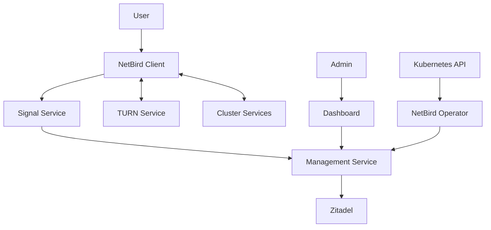

# NetBird Secure Gateway

[NetBird](https://netbird.io/) is deployed as the secure gateway solution for the homelab Kubernetes cluster. This document outlines the configuration, usage, and integration points.

## Overview

NetBird provides:

- Zero-trust network access to cluster services
- WireGuard-based secure overlay network
- Peer-to-peer connectivity
- Integration with Zitadel for authentication
- Fine-grained access policies

## Architecture

The NetBird deployment consists of multiple components:

1. **Management Service** - Central management component
2. **Signal Service** - Facilitates peer discovery
3. **TURN Service (Coturn)** - Assists with NAT traversal
4. **Dashboard** - Web UI for management
5. **Kubernetes Operator** - Manages NetBird resources within Kubernetes



## Configuration

### Network Setup

- **Dashboard URL**: https://netbird.homelab.local
- **Authentication**: Integrated with Zitadel OIDC
- **Network Range**: 100.64.0.0/10 (default NetBird range)

### Authentication

NetBird is configured to use Zitadel as its identity provider:

- Users authenticate through Zitadel's OIDC interface
- User permissions are mapped from Zitadel roles
- Single sign-on experience across all services

### Exposing Services

To expose a service securely through NetBird:

1. Create a NetBird network policy (ACL)
2. Define who can access the service
3. Configure the service to be accessible via the NetBird network
4. Users connect through the NetBird client

Example policy for a web service:
```yaml
apiVersion: networkpolicy.netbird.io/v1alpha1
kind: NetworkPolicy
metadata:
  name: allow-web-access
  namespace: netbird
spec:
  name: "Allow Web Access"
  description: "Allow access to web services"
  rules:
    - name: "Allow HTTP/HTTPS"
      description: "Allow HTTP/HTTPS traffic"
      enabled: true
      action: "accept"
      protocol: "tcp"
      ports:
        - "80"
        - "443"
  sources:
    - name: "All Users"
      tags:
        - "users"
  destinations:
    - name: "Web Servers"
      tags:
        - "web"
```

## Client Installation

Users can connect to the NetBird network by:

1. Installing the NetBird client from [netbird.io](https://netbird.io/)
2. Logging in with their Zitadel credentials
3. Accessing permitted services securely

## Security Recommendations

- Implement least-privilege access policies
- Regularly audit access logs
- Rotate keys and secrets periodically
- Use multi-factor authentication (via Zitadel)
- Monitor for unauthorized access attempts

## Troubleshooting

### Common Issues

- **Connection Problems**: Check if the NetBird client is connected
- **Authentication Failures**: Verify Zitadel integration and user permissions
- **Service Access Issues**: Confirm network policies are correctly configured
- **NAT Traversal Problems**: Ensure TURN service is functioning properly

### Logs

Access logs with:

```bash
kubectl logs -n netbird -l app.kubernetes.io/name=netbird-management
```

For signal service logs:
```bash
kubectl logs -n netbird -l app.kubernetes.io/name=netbird-signal
```

For TURN service logs:
```bash
kubectl logs -n netbird -l app.kubernetes.io/name=netbird-coturn
```

## Admin Dashboard

The NetBird dashboard provides:

- User management interface
- Network topology visualization
- Policy configuration
- Audit logs
- Performance metrics

Access the dashboard at https://netbird.homelab.local
