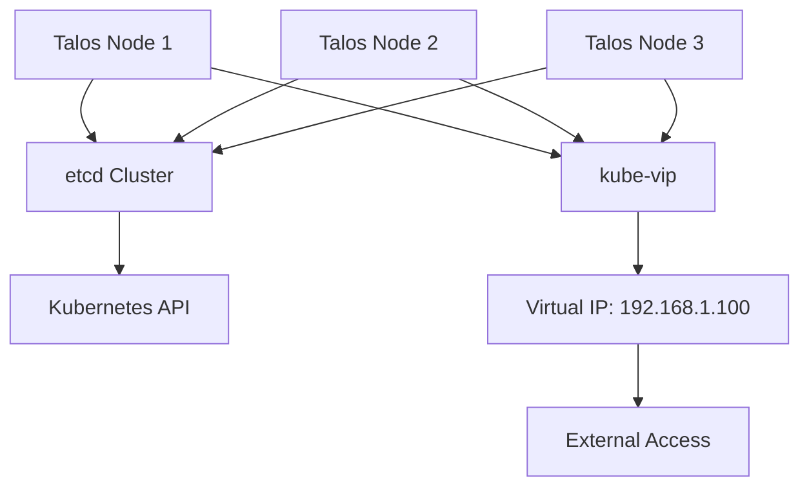

# Component Overview

This document provides an overview of the Kubernetes cluster components, architecture, and implementation details.

## Architecture

The cluster architecture consists of several integrated parts that work together to provide a complete, secure, and highly available system.

### High Availability Infrastructure

This cluster implements high availability through:

1. **Multiple Control Plane Nodes**: All three machines serve as both control plane and worker nodes, ensuring high availability of the Kubernetes API and control plane components.

2. **Distributed etcd**: etcd runs across all three control plane nodes in a quorum configuration, where operations require a majority (at least 2 nodes) to succeed.

3. **Virtual IP with kube-vip**: kube-vip provides a virtual IP (192.168.1.100) that automatically floats between available control plane nodes, ensuring continuous access to the API server even if a node fails.

4. **Workload Distribution**: All nodes run both control plane components and regular workloads, maximizing resource utilization while maintaining redundancy.



### Identity and Access Management

Zitadel serves as the identity provider for the cluster:

1. **Comprehensive IAM Solution**: Provides complete user management, authentication, and authorization.

2. **Multiple Protocol Support**: Implements OIDC, OAuth2.x, SAML2, and LDAP for versatile integration.

3. **Advanced Security Features**: Supports passkeys/FIDO2, OTP, and other modern authentication methods.

4. **Kubernetes Integration**: Integrates with Kubernetes for RBAC authorization.

5. **Multi-tenancy**: Supports organizational structures and team management.

### Secure Network Access

NetBird provides secure access to cluster services:

1. **Zero-Trust Networking**: Implements a WireGuard-based secure overlay network.

2. **Identity Integration**: Authenticates users via Zitadel for consistent access control.

3. **Peer-to-Peer Connectivity**: Enables direct connections between clients and services.

4. **Granular Access Policies**: Provides fine-grained control over service access.

5. **Kubernetes Operator**: Manages network resources natively within Kubernetes.

### Storage Infrastructure

CubeFS provides distributed storage for the cluster:

1. **Distributed File System**: Enables persistent storage across nodes.

2. **High Availability**: Replicates data across nodes for fault tolerance.

3. **Kubernetes Integration**: Integrates with Kubernetes via StorageClass.

### Secret Management

SOPS with AGE encryption secures sensitive data:

1. **Git-Compatible Encryption**: Safely stores encrypted secrets in the repository.

2. **Flux Integration**: Automatic decryption when deploying to the cluster.

3. **Secure Key Management**: Keeps private keys separate from the repository.

## Repository Structure

The repository follows a GitOps approach with the following structure:

```
homelab/
├── .github/                     # GitHub Actions workflows and Renovate bot configuration
├── .sops/                       # SOPS encryption keys (gitignored)
├── bootstrap/                   # Bootstrap scripts and tools
│   ├── talos/                   # Talos-specific bootstrap configurations
│   └── vm/                      # Mac Mini VM setup instructions
├── cluster/                     # Kubernetes resources
│   ├── apps/                    # Application deployments
│   │   └── demo/                # Sample demo application
│   ├── core/                    # Core components
│   │   ├── cert-manager/         # Certificate management with Let's Encrypt
│   │   ├── cubefs/              # CubeFS distributed storage
│   │   ├── external-dns/         # Automatic DNS management with Cloudflare
│   │   ├── karpor/              # Karpor Kubernetes visualization and intelligence
│   │   ├── kube-system/         # Kubernetes system components
│   │   ├── kube-vip/            # Kube-vip for virtual IP (high availability)
│   │   ├── zitadel/             # Zitadel identity provider
│   │   └── netbird/             # NetBird secure gateway
│   ├── config/                  # Cluster-wide configurations
│   ├── flux/                    # Flux CD configuration
│   └── secrets/                 # Encrypted secrets
│       ├── zitadel/             # Zitadel secrets
│       └── netbird/             # NetBird secrets
├── docs/                        # Documentation
├── infrastructure/              # Infrastructure configurations
│   └── talos/                   # Talos OS configurations
│       └── controlplane/        # Control plane node configs
└── scripts/                     # Utility scripts
    └── sops/                    # SOPS secret management scripts
```

## Implemented Components

Here's a summary of the main components implemented in the cluster:

### Bootstrap Tools

The bootstrap directory contains scripts and tools to initialize the cluster:

- `bootstrap.sh`: Main script to bootstrap the entire cluster
- `talos/gen-config.sh`: Generates Talos OS configurations
- `vm/setup-mac-mini-vm.sh`: Helper script for Mac Mini VM setup

### Core Components

The core infrastructure components include:

- **CubeFS**: Distributed file system for persistent storage
- **cert-manager**: Manages SSL/TLS certificates with Let's Encrypt
- **external-dns**: Automatically updates DNS records in Cloudflare
- **Karpor**: Kubernetes visualization and intelligence tool
- **kube-vip**: Virtual IP manager for high availability
- **Zitadel**: Identity and access management
- **NetBird**: Secure gateway for service access

### GitOps Deployment

Flux CD is used for GitOps-style deployment and includes:

- Helm repository sources
- Kustomizations for deploying components
- Infrastructure components

### Secret Management

Secrets are managed using SOPS with AGE encryption:

- Encrypted secrets stored in the repository
- Automatic decryption by Flux when deploying to the cluster
- Scripts for encrypting and decrypting secrets

### Sample Application

A demo application is included as a reference:

- Simple NGINX deployment
- Service definition
- Namespace configuration

## Automation

The repository includes GitHub Actions for:

- Validating Kubernetes manifests
- Linting YAML files
- Renovate bot for dependency updates
