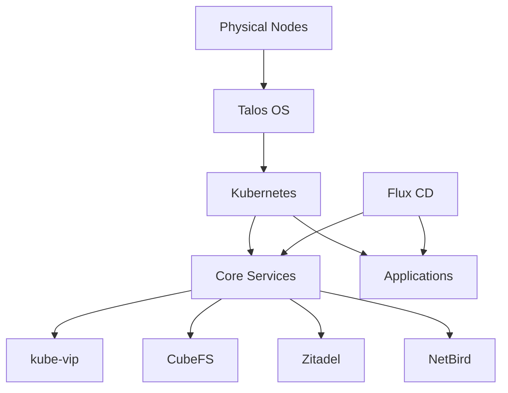

# Getting Started

This guide provides a quick overview of the steps to set up your homelab Kubernetes cluster. For detailed installation instructions, see the [Installation Guide](installation.md).

## Prerequisites

Before you begin, make sure you have:

- Three physical machines or VMs (including the Mac Mini)
- A workstation with necessary tools installed
- Local network with DHCP
- Required software tools:
  - `kubectl`
  - `talosctl`
  - `flux`
  - `sops`
  - `age`

## Quick Start Steps

1. **Prepare Hardware**
   - Set up physical servers or VMs
   - Boot them with Talos OS

2. **Deploy Control Plane**
   - Generate Talos configurations
   - Apply configurations to nodes
   - Bootstrap the Kubernetes cluster
   - Set up high availability components

3. **Configure Secure Access**
   - Deploy Zitadel identity provider
   - Set up NetBird secure gateway
   - Configure authentication integration

4. **Set Up Storage**
   - Deploy CubeFS distributed storage
   - Create storage classes
   - Configure persistent volumes

5. **Deploy Applications**
   - Set up Flux CD for GitOps
   - Deploy core services
   - Add custom applications

## Key Components

The cluster includes several key components:

- **Talos OS**: Secure, immutable operating system
- **Kubernetes**: Container orchestration
- **kube-vip**: Virtual IP management 
- **Zitadel**: Identity and access management
- **NetBird**: Secure gateway
- **CubeFS**: Distributed storage
- **SOPS**: Secret management

## Architecture Diagram

## Next Steps

After setting up the basic cluster, explore these areas:

- [Installation Guide](installation.md): Detailed installation instructions
- [Configuration Guide](configuration.md): Advanced configuration options
- [Troubleshooting Guide](troubleshooting.md): Solutions to common issues
- [Component Documentation](../components/overview.md): Detailed component information

## Virtual IPs

The cluster uses the following virtual IPs:

| Service | IP Address | Description |
|---------|------------|-------------|
| Kubernetes API | 192.168.1.100 | Kubernetes control plane access |
| Zitadel | 192.168.1.110 | Identity provider interface |

## Support

If you encounter issues or have questions, check the [Troubleshooting Guide](troubleshooting.md) or file an issue on the GitHub repository.
