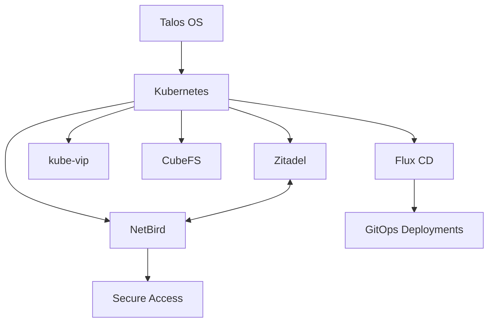

# Homelab Kubernetes Cluster

Welcome to the documentation for the Homelab Kubernetes Cluster project. This documentation provides comprehensive information on setting up, configuring, and maintaining your home Kubernetes cluster.

## Overview

This project implements a high-availability Kubernetes cluster running on three mini servers:

- Apple M1 Mac mini
- Intel 4-core, 8GB RAM mini PC
- Ryzen 5825u, 32GB RAM mini PC

## Key Features

- [Talos OS](https://www.talos.dev/) as the operating system and Kubernetes distribution
- GitOps deployment using [Flux CD](https://fluxcd.io/)
- High availability control plane with 3 nodes
- Virtual IP management via [kube-vip](https://kube-vip.io/)
- Identity management with [Zitadel](https://zitadel.com/)
- Secure service access via [NetBird](https://netbird.io/)
- Distributed storage with [CubeFS](https://www.cubefs.io)
- Kubernetes visualization and intelligence with [Karpor](https://github.com/KusionStack/karpor)
- Automatic SSL certificates with [cert-manager](https://cert-manager.io/) and Let's Encrypt
- DNS automation with [external-dns](https://github.com/kubernetes-sigs/external-dns) and Cloudflare
- Secret management with [SOPS](https://github.com/getsops/sops) and [Age](https://github.com/FiloSottile/age)

## Architecture

The cluster architecture consists of several key components working together:

## Getting Started

To get started with the Homelab Kubernetes Cluster, see the [Getting Started](guide/getting-started.md) guide, which will walk you through the installation and initial configuration.

## Hardware Setup

| Node | Role | Hardware | IP Address |
|------|------|----------|------------|
| talos-cp1 | Control Plane + Worker | Ryzen 5825u, 32GB RAM | 192.168.1.101 |
| talos-cp2 | Control Plane + Worker | Intel 4-core, 8GB RAM | 192.168.1.102 |
| talos-cp3 | Control Plane + Worker | Mac mini M1 (VM) | 192.168.1.103 |

## Virtual IP Addresses

| Service | Virtual IP | Description |
|---------|------------|-------------|
| Kubernetes API | 192.168.1.100 | Kubernetes control plane access |
| Zitadel | 192.168.1.110 | Identity provider interface |
