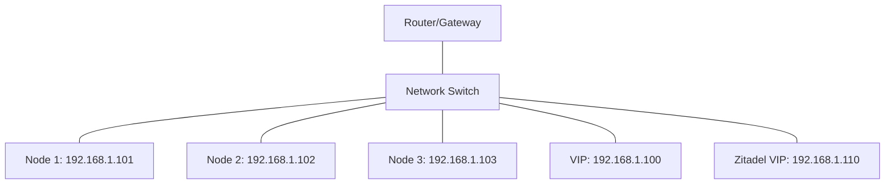

# Hardware Reference

This document provides detailed information about the hardware used in the homelab Kubernetes cluster.

## Cluster Nodes

The cluster consists of three physical nodes, each serving as both control plane and worker node:

| Node | Hardware | Role | IP Address |
|------|----------|------|------------|
| talos-cp1 | Ryzen 5825u, 32GB RAM | Control Plane + Worker | 192.168.1.101 |
| talos-cp2 | Intel 4-core, 8GB RAM | Control Plane + Worker | 192.168.1.102 |
| talos-cp3 | Mac mini M1 (VM) | Control Plane + Worker | 192.168.1.103 |

## Node Details

### Node 1: Ryzen 5825u

- **CPU**: AMD Ryzen 5825u (8 cores, 16 threads)
- **RAM**: 32GB DDR4
- **Storage**: 500GB NVMe SSD
- **Network**: 1Gbps Ethernet
- **Role**: Primary control plane node, worker node
- **IP**: 192.168.1.101

### Node 2: Intel Mini PC

- **CPU**: Intel quad-core processor
- **RAM**: 8GB DDR4
- **Storage**: 256GB SSD
- **Network**: 1Gbps Ethernet
- **Role**: Secondary control plane node, worker node
- **IP**: 192.168.1.102

### Node 3: Mac Mini M1 (VM)

- **Host**: Apple Mac Mini with M1 processor
- **Virtualization**: UTM
- **VM Configuration**:
  - **CPU**: 4-6 cores allocated from M1
  - **RAM**: 8-12GB allocated
  - **Storage**: 40GB+ virtual disk
  - **Network**: Bridged networking
- **Role**: Tertiary control plane node, worker node
- **IP**: 192.168.1.103

## Resource Allocation

### Control Plane Components

Each control plane node runs:

- **etcd**: 
  - Memory request: 512Mi
  - CPU request: 250m
- **kube-apiserver**:
  - Memory request: 256Mi
  - CPU request: 250m
- **kube-controller-manager**:
  - Memory request: 128Mi
  - CPU request: 100m
- **kube-scheduler**:
  - Memory request: 64Mi
  - CPU request: 100m

### Core Services

Resource allocation for core services:

- **CubeFS**:
  - Master: 256Mi memory, 200m CPU
  - Metanode: 512Mi memory, 200m CPU
  - Datanode: 512Mi memory, 200m CPU
- **Zitadel**:
  - 512Mi memory, 200m CPU
  - Database: 1Gi memory, 500m CPU
- **NetBird**:
  - Management: 256Mi memory, 100m CPU
  - Signal: 128Mi memory, 50m CPU
  - TURN: 128Mi memory, 100m CPU
- **kube-vip**:
  - 128Mi memory, 100m CPU

## Network Configuration

### Network Topology



### Virtual IPs

The cluster uses the following virtual IPs:

| Service | IP Address | Description |
|---------|------------|-------------|
| Kubernetes API | 192.168.1.100 | Kubernetes control plane access |
| Zitadel | 192.168.1.110 | Identity provider interface |

### Network Services

- **DNS**: Local DNS server or hosts file entries
- **DHCP**: Provided by local network router (optional)
- **NTP**: time.cloudflare.com (configured in Talos)

## Storage Configuration

### Physical Storage

Each node contributes storage to the CubeFS distributed filesystem:

- **Node 1**: 100GB allocated
- **Node 2**: 50GB allocated
- **Node 3**: 40GB allocated

### Storage Classes

| Name | Provisioner | Parameters | Default |
|------|-------------|------------|---------|
| cubefs-storage | cubefs.csi.cubefs.com | volType: extent | Yes |

## Scaling Considerations

### Adding New Nodes

When adding new nodes to the cluster:

1. Hardware should meet minimum requirements:
   - 4+ CPU cores
   - 8GB+ RAM
   - 50GB+ storage
   - 1Gbps network connectivity

2. For control plane nodes:
   - Ensure odd number of nodes for etcd quorum
   - Minimum 3 nodes recommended
   - Maximum 7 nodes recommended

3. For worker-only nodes:
   - Can add as many as network and resources allow
   - Consider network topology for performance

### Upgrading Hardware

When upgrading hardware:

1. Drain the node:
   ```bash
   kubectl drain <node-name> --ignore-daemonsets
   ```

2. Perform hardware upgrade

3. Update Talos configuration if necessary:
   ```bash
   talosctl apply-config --nodes <node-ip> --file new-config.yaml
   ```

4. Uncordon the node:
   ```bash
   kubectl uncordon <node-name>
   ```

## Maintenance Procedures

### Regular Maintenance

1. Keep firmware and drivers updated
2. Monitor disk health and performance
3. Ensure proper cooling and ventilation
4. Check physical connections periodically
5. Verify power redundancy if applicable

### Backups

1. VM backups for the Mac Mini node
2. Persistent volume backups
3. etcd backups
