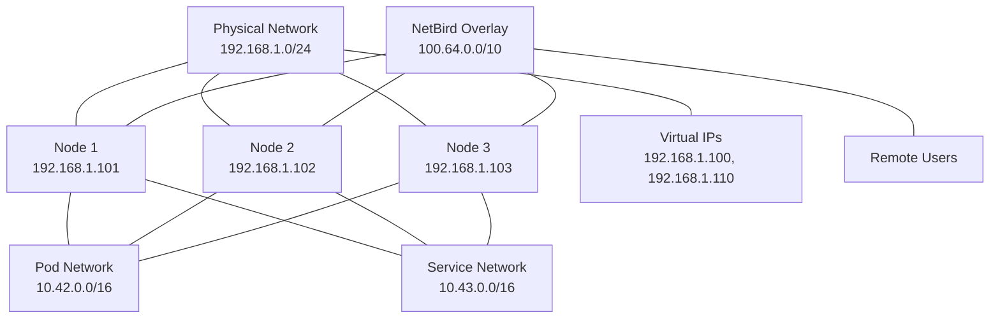

# Network Reference

This document provides detailed information about the network configuration used in the homelab Kubernetes cluster.

## Network Topology

The cluster network consists of several layers:

1. **Physical Network**: Connects the physical nodes
2. **Kubernetes Pod Network**: Managed by Cilium
3. **Service Network**: For Kubernetes services
4. **Virtual IP Layer**: Managed by kube-vip
5. **NetBird Overlay**: For secure remote access



## IP Address Allocation

### Physical Network

| Device | IP Address | Description |
|--------|------------|-------------|
| Node 1 (Ryzen) | 192.168.1.101 | Primary control plane |
| Node 2 (Intel) | 192.168.1.102 | Secondary control plane |
| Node 3 (Mac Mini) | 192.168.1.103 | Tertiary control plane |

### Virtual IPs

| Service | IP Address | Description |
|---------|------------|-------------|
| Kubernetes API | 192.168.1.100 | Control plane access |
| Zitadel | 192.168.1.110 | Identity provider |

### Kubernetes Networks

| Network | CIDR | Description |
|---------|------|-------------|
| Pod Network | 10.42.0.0/16 | Cilium-managed pod network |
| Service Network | 10.43.0.0/16 | Kubernetes service network |

### NetBird Overlay

| Network | CIDR | Description |
|---------|------|-------------|
| NetBird Overlay | 100.64.0.0/10 | WireGuard-based secure overlay network |

## DNS Configuration

### Local DNS Entries

Add the following entries to your local DNS server or `/etc/hosts` file:

```
192.168.1.100  k8s.homelab.local
192.168.1.110  id.homelab.local
192.168.1.xxx  netbird.homelab.local  # Replace xxx with actual IP
```

### In-Cluster DNS

CoreDNS provides in-cluster DNS resolution with the following configuration:

- Domain: `cluster.local`
- Service discovery: `<service-name>.<namespace>.svc.cluster.local`
- Pod discovery: `<pod-ip>.<namespace>.pod.cluster.local`

## Network Security

### Network Policies

The cluster uses Kubernetes Network Policies to restrict pod-to-pod communication:

```yaml
apiVersion: networking.k8s.io/v1
kind: NetworkPolicy
metadata:
  name: default-deny
  namespace: default
spec:
  podSelector: {}
  policyTypes:
  - Ingress
  - Egress
```

### Firewall Recommendations

Recommended firewall rules for the cluster:

| Source | Destination | Port | Protocol | Description |
|--------|-------------|------|----------|-------------|
| Admin Workstation | 192.168.1.101-103 | 50000 | TCP | Talos API |
| Admin Workstation | 192.168.1.100 | 6443 | TCP | Kubernetes API |
| Any | 192.168.1.110 | 443 | TCP | Zitadel HTTPS |
| Any | NetBird Range | 51820 | UDP | WireGuard |
| Nodes | Nodes | All | All | Inter-node communication |

## kube-vip Configuration

kube-vip provides virtual IP management for the cluster:

### Control Plane VIP

```yaml
apiVersion: v1
kind: ConfigMap
metadata:
  name: kube-vip-config
  namespace: kube-system
data:
  config.yaml: |
    vip_interface: "eth0"
    vip_address: "192.168.1.100"
    vip_leaderelection: true
    enable_loadbalancer: true
    port: 6443
```

### Service Load Balancer

```yaml
apiVersion: v1
kind: Service
metadata:
  name: zitadel-lb
  namespace: zitadel
  annotations:
    kube-vip.io/loadbalancerIPs: "192.168.1.110"
spec:
  type: LoadBalancer
  ports:
    - port: 443
      targetPort: 8080
  selector:
    app.kubernetes.io/name: zitadel
```

## Cilium CNI Configuration

Cilium provides the Container Network Interface (CNI) for the cluster:

```yaml
apiVersion: helm.toolkit.fluxcd.io/v2beta1
kind: HelmRelease
metadata:
  name: cilium
  namespace: kube-system
spec:
  values:
    ipam:
      mode: kubernetes
    kubeProxyReplacement: strict
    k8sServiceHost: 192.168.1.100
    k8sServicePort: 6443
```

## NetBird Configuration

NetBird provides secure access to the cluster:

### Management Service

```yaml
env:
  AUTH_OIDC_ENABLED: "true"
  AUTH_OIDC_ISSUER: "https://id.homelab.local"
  AUTH_OIDC_CLIENT_ID: "${SECRET_OIDC_CLIENT_ID}"
```

### Network Policy Example

```yaml
apiVersion: networkpolicy.netbird.io/v1alpha1
kind: NetworkPolicy
metadata:
  name: allow-web-access
spec:
  name: "Allow Web Access"
  description: "Allow access to web services"
  rules:
    - name: "Allow HTTP/HTTPS"
      protocol: "tcp"
      ports:
        - "80"
        - "443"
  sources:
    - tags:
        - "users"
  destinations:
    - tags:
        - "web"
```

## Troubleshooting Network Issues

### Checking Connectivity

```bash
# Test node connectivity
ping 192.168.1.101

# Test virtual IP
ping 192.168.1.100

# Test Kubernetes API
curl -k https://192.168.1.100:6443/version

# Test pod communication
kubectl exec -it <pod-name> -- ping <other-pod-ip>
```

### Checking Network Policies

```bash
# List network policies
kubectl get netpol -A

# Describe a network policy
kubectl describe netpol <policy-name> -n <namespace>
```

### Checking kube-vip Status

```bash
# Check if kube-vip is running
kubectl get pods -n kube-system -l name=kube-vip

# Check kube-vip logs
kubectl logs -n kube-system -l name=kube-vip

# Check ARP table
ip neigh show
```

### Checking Cilium Status

```bash
# Check Cilium pods
kubectl get pods -n kube-system -l k8s-app=cilium

# Check Cilium status
kubectl -n kube-system exec -it <cilium-pod-name> -- cilium status

# Check Cilium endpoints
kubectl -n kube-system exec -it <cilium-pod-name> -- cilium endpoint list
```

## Network Performance Considerations

### Optimizing Performance

1. **MTU Configuration**: Configure optimal MTU for your network
2. **Inter-Node Bandwidth**: Ensure sufficient bandwidth between nodes
3. **Quality of Service**: Implement QoS for critical services
4. **Load Balancing**: Distribute workloads evenly across nodes

### Monitoring Network Performance

```bash
# Check node network stats
kubectl top nodes

# Check pod network stats
kubectl top pods -A

# Monitor network throughput
iperf3 -c <node-ip> -p <port>
```
