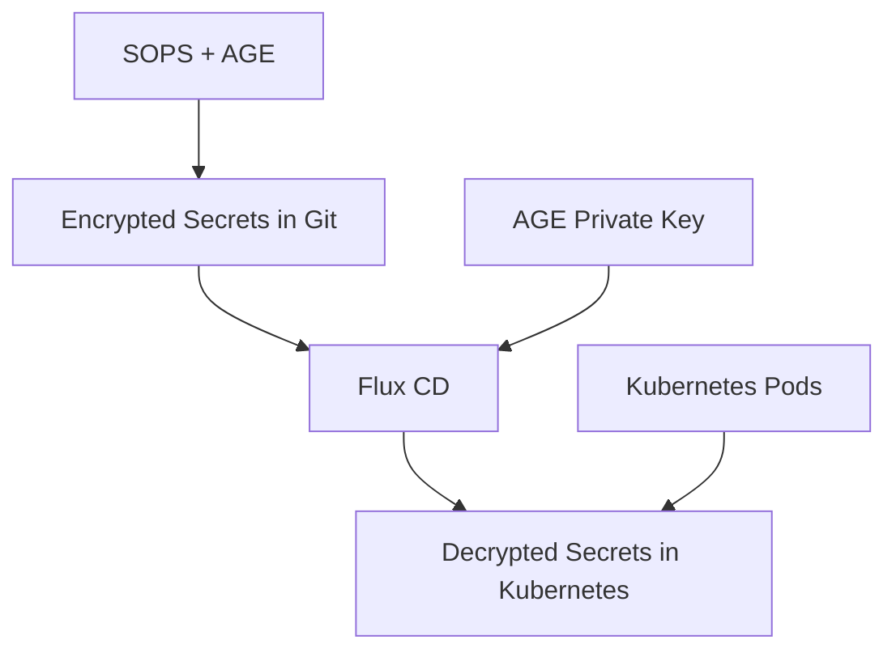

# Secrets Management

This document provides detailed information about the secrets management approach used in the homelab Kubernetes cluster.

## Overview

The cluster uses SOPS with AGE encryption to securely store and manage Kubernetes secrets. This approach allows:

- **Git-Compatible Encryption**: Secrets can be safely committed to the repository
- **GitOps Integration**: Flux automatically decrypts secrets when applying them
- **Key Management**: Private keys remain separate from the repository
- **Selective Encryption**: Only sensitive fields are encrypted

## Architecture

The secrets management architecture consists of:



## Directory Structure

The secrets are stored in the repository with the following structure:

```
homelab/
├── .sops/                      # SOPS encryption keys (gitignored)
│   └── age.agekey              # Private AGE key (never committed)
├── .sops.yaml                  # SOPS configuration
├── cluster/
│   └── secrets/                # Encrypted secrets
│       ├── zitadel/            # Zitadel secrets
│       └── netbird/            # NetBird secrets
└── scripts/
    └── sops/                   # SOPS helper scripts
```

## SOPS Configuration

The `.sops.yaml` file defines the encryption rules:

```yaml
creation_rules:
  # Encrypt with AGE
  - path_regex: .*.ya?ml
    encrypted_regex: ^(data|stringData)$
    age: >-
      age1xxxxxxxxxxxxxxxxxxxxxxxxxxxxxxxxxxxxxxxxxxxxxxxxxx
```

This configuration ensures:

- Only files matching the pattern `*.yaml` or `*.yml` are encrypted
- Only the `data` and `stringData` fields are encrypted
- The specified AGE public key is used for encryption

## Helper Scripts

The repository includes several helper scripts for working with secrets:

### 1. Generate Key

`scripts/sops/generate-key.sh` - Generates a new AGE key pair:

```bash
./scripts/sops/generate-key.sh
```

This creates:
- A private key in `.sops/age.agekey`
- Updates the `.sops.yaml` file with the public key

### 2. Encrypt Secret

`scripts/sops/encrypt.sh` - Encrypts a Kubernetes secret:

```bash
./scripts/sops/encrypt.sh path/to/secret.yaml
```

### 3. Decrypt Secret

`scripts/sops/decrypt.sh` - Decrypts a Kubernetes secret:

```bash
# View decrypted content
./scripts/sops/decrypt.sh path/to/encrypted-secret.yaml

# Save decrypted content to a file
./scripts/sops/decrypt.sh path/to/encrypted-secret.yaml --stdout > decrypted.yaml
```

### 4. Create Flux Secret

`scripts/sops/create-age-secret.sh` - Creates the encrypted AGE key secret for Flux:

```bash
./scripts/sops/create-age-secret.sh
```

## Example Secret

A typical encrypted secret looks like:

```yaml
apiVersion: v1
kind: Secret
metadata:
    name: example-secret
    namespace: default
type: Opaque
stringData:
    username: ENC[AES256_GCM,data:KapUuZM=,iv:epW3...,tag:tGr0...,type:str]
    password: ENC[AES256_GCM,data:s0JdHT9OHH,iv:J+qV...,tag:Qy1d...,type:str]
sops:
    kms: []
    gcp_kms: []
    azure_kv: []
    hc_vault: []
    age:
        - recipient: age1...
          enc: |
            ...
    lastmodified: "2023-04-26T09:25:21Z"
    mac: ENC[AES256_GCM,data:cPkD...,iv:nrN/...,tag:bVH4...,type:str]
    pgp: []
    unencrypted_suffix: _unencrypted
    version: 3.7.3
```

Notice that only the `stringData` values are encrypted, while the rest of the YAML remains in plaintext.

## Flux Integration

Flux is configured to decrypt secrets using the following components:

### 1. AGE Secret

The AGE private key is stored in a Kubernetes secret in the `flux-system` namespace:

```yaml
apiVersion: v1
kind: Secret
metadata:
    name: sops-age
    namespace: flux-system
stringData:
    age.agekey: AGE-SECRET-KEY-...
```

This secret is itself encrypted with SOPS for secure storage in the repository.

### 2. Kustomize Controller Configuration

The Flux kustomize-controller is configured to use the AGE key for decryption:

```yaml
apiVersion: apps/v1
kind: Deployment
metadata:
  name: kustomize-controller
  namespace: flux-system
spec:
  template:
    spec:
      containers:
      - name: manager
        env:
        - name: SOPS_AGE_KEY_FILE
          value: /etc/fluxcd/keys/age.agekey
        volumeMounts:
        - name: sops-age
          mountPath: /etc/fluxcd/keys
          readOnly: true
      volumes:
      - name: sops-age
        secret:
          secretName: sops-age
          defaultMode: 0400
```

## Manual Operation

To manually work with SOPS-encrypted secrets:

### Encrypting a Secret

```bash
# Using the helper script
./scripts/sops/encrypt.sh path/to/secret.yaml

# Or directly with SOPS
SOPS_AGE_KEY_FILE=./.sops/age.agekey sops --encrypt --in-place path/to/secret.yaml
```

### Decrypting a Secret

```bash
# Using the helper script
./scripts/sops/decrypt.sh path/to/secret.yaml

# Or directly with SOPS
SOPS_AGE_KEY_FILE=./.sops/age.agekey sops --decrypt path/to/secret.yaml
```

### Editing a Secret

```bash
# Using SOPS directly
SOPS_AGE_KEY_FILE=./.sops/age.agekey sops path/to/encrypted-secret.yaml
```

## Key Rotation

To rotate the AGE key:

1. Generate a new AGE key:
   ```bash
   ./scripts/sops/generate-key.sh
   ```

2. Re-encrypt all secrets with the new key:
   ```bash
   # First decrypt with the old key
   SOPS_AGE_KEY_FILE=./old-key sops --decrypt secret.yaml > secret-decrypted.yaml
   
   # Then encrypt with the new key
   SOPS_AGE_KEY_FILE=./.sops/age.agekey sops --encrypt --in-place secret-decrypted.yaml
   
   # Replace the original file
   mv secret-decrypted.yaml secret.yaml
   ```

3. Update the Flux secret with the new key:
   ```bash
   ./scripts/sops/create-age-secret.sh
   ```

## Security Considerations

### Private Key Management

- **Never commit the private key** to the Git repository
- **Back up the private key** securely (password manager, encrypted backup)
- **Limit access** to the private key to authorized personnel only
- **Store the private key** separately from the repository

### Access Control

- **Limit repository access** to trusted individuals
- **Use branch protection** rules to prevent unauthorized changes
- **Regular audit** of who has access to the repository and keys

## Troubleshooting

### Common Issues

#### "Failed to get the data key"

This usually means the private key is incorrect or missing. Ensure:
- The `.sops/age.agekey` file exists
- The key matches the public key in `.sops.yaml`
- The environment variable `SOPS_AGE_KEY_FILE` is set correctly

#### "Integrity check failed"

This indicates the encrypted file has been corrupted. You may need to restore from a previous commit or re-encrypt the file.

#### "Could not find common data"

The file might not be a valid SOPS encrypted file. Verify the file format and encryption status.

### Debugging Commands

```bash
# Verify the AGE key
cat .sops/age.agekey | grep "public key:"

# Check SOPS configuration
cat .sops.yaml

# Test decryption
SOPS_AGE_KEY_FILE=./.sops/age.agekey sops --decrypt --verbose path/to/file.yaml
```

## References

- [SOPS Documentation](https://github.com/getsops/sops)
- [AGE Encryption Tool](https://github.com/FiloSottile/age)
- [Flux SOPS Integration](https://fluxcd.io/flux/guides/mozilla-sops/)
