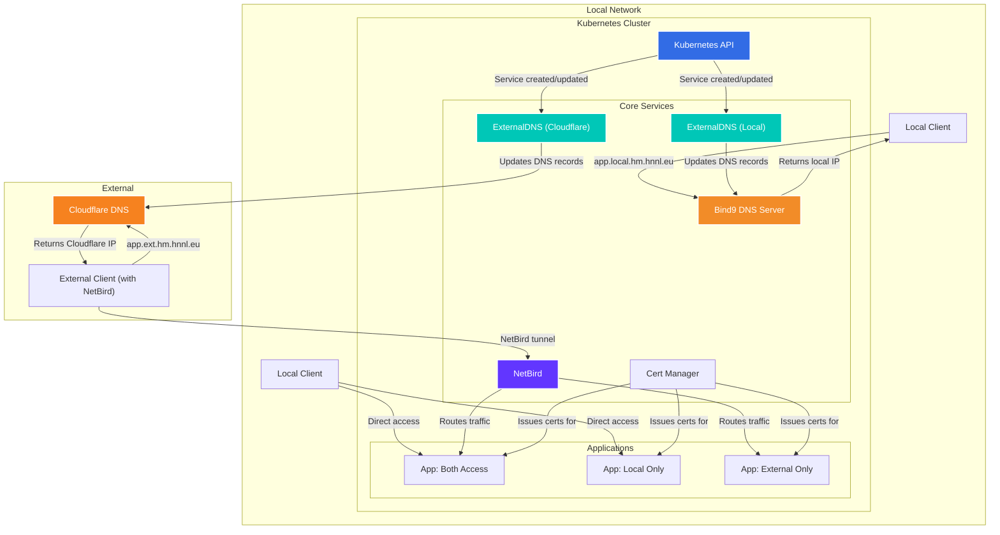

```mermaid
graph TB
    subgraph "Local Network"
        Client1["Local Client"]
        Client2["Local Client"]
        
        subgraph "Kubernetes Cluster"
            K8S["Kubernetes API"]
            
            subgraph "Core Services"
                B9["Bind9 DNS Server"]
                ED1["ExternalDNS (Cloudflare)"]
                ED2["ExternalDNS (Local)"]
                NB["NetBird"]
                CM["Cert Manager"]
            end
            
            subgraph "Applications"
                APP1["App: Both Access"]
                APP2["App: Local Only"]
                APP3["App: External Only"]
            end
        end
    end
    
    subgraph "External"
        ExtClient["External Client (with NetBird)"]
        CF["Cloudflare DNS"]
    end
    
    %% Local DNS Resolution
    Client1 -->|"app.local.hm.hnnl.eu"| B9
    B9 -->|"Returns local IP"| Client1
    
    %% External DNS Resolution
    ExtClient -->|"app.ext.hm.hnnl.eu"| CF
    CF -->|"Returns Cloudflare IP"| ExtClient
    
    %% ExternalDNS workflows
    K8S -->|"Service created/updated"| ED1
    K8S -->|"Service created/updated"| ED2
    ED1 -->|"Updates DNS records"| CF
    ED2 -->|"Updates DNS records"| B9
    
    %% Access paths
    Client2 -->|"Direct access"| APP1
    Client2 -->|"Direct access"| APP2
    ExtClient -->|"NetBird tunnel"| NB
    NB -->|"Routes traffic"| APP1
    NB -->|"Routes traffic"| APP3
    
    %% Certificate management
    CM -->|"Issues certs for"| APP1
    CM -->|"Issues certs for"| APP2
    CM -->|"Issues certs for"| APP3
    
    style K8S fill:#326CE5,stroke:#fff,stroke-width:2px,color:#fff
    style B9 fill:#F28C28,stroke:#fff,stroke-width:2px,color:#fff
    style ED1 fill:#00C7B7,stroke:#fff,stroke-width:2px,color:#fff
    style ED2 fill:#00C7B7,stroke:#fff,stroke-width:2px,color:#fff
    style NB fill:#6236FF,stroke:#fff,stroke-width:2px,color:#fff
    style CF fill:#F6821F,stroke:#fff,stroke-width:2px,color:#fff
```
